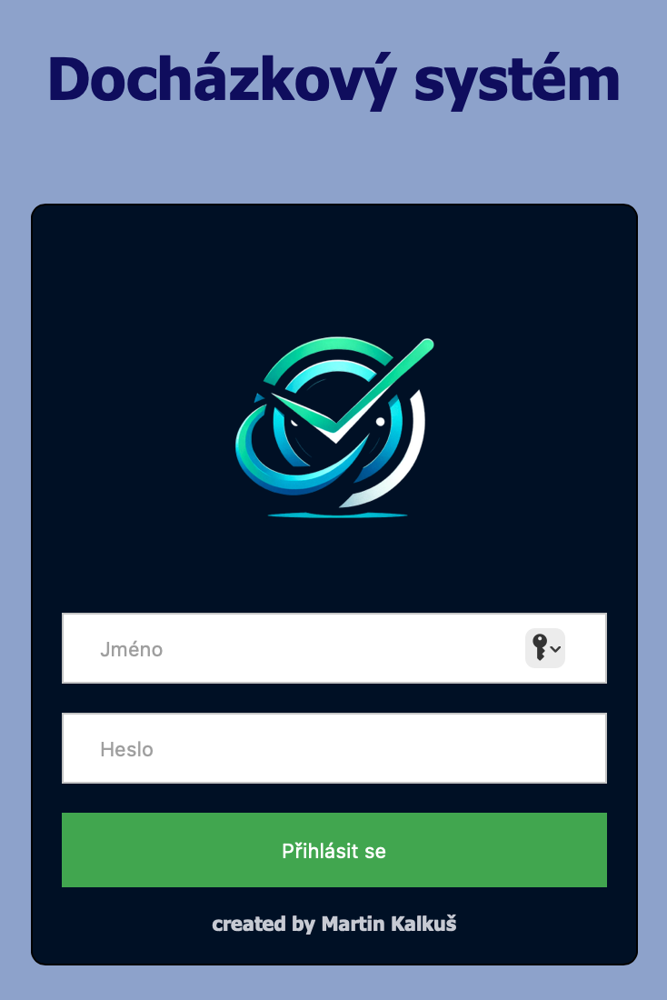

# Docházka

Vytvoření vlastního docházkového systému pro naši společnost, snížení tak vlastních nákladů společnosti a odproštění se tak od nutnosti používání systému třetích stran. 


## Úvod

Systém docházky pro trakování zaměstnanců na pracovišti. 
Bude se jednat o firemní databázi zaměstnanců/spolupracovníků, sledující dobu na pracovišti. 
Každý zaměstnanec bude mít své ID , pomocí kterého bude identifikován. 

## Aktuálně
Obsahuje login page, ověření uživatelů přes databázi a přesměrování po úspěšném přihlášení.

### Roadmap
1. Hlavní stránka s jednotlivými tlačítkovými možnostmi (příchod, odchod, lékař, dovolená apod.)
2. Napojení hlavní stránky na databázi, vytvoření tabulek pro jednotlivé zaměstnance/osoby

## Instalace

```pip install -r requirements.txt```

### Příprava Databáze
Pro vytvoření databáze lze použít sript v dochazka_script.sql a spustit jednotlivé SQL dotazy.
V reálném prostředí se předpokládá napojení pod vlastním security_key a bude nutné tedy lehce poupravit dle vlastních potřeb.

## Použití

Získávání dat o pohybu zaměstnanců v procesu a vytvoření podkladů pro mzdovou účetní.
Získávání dat o konzumaci času nutného ke zhotovení práce specifické stavební práce a určení tak vhodného nákladu při tvorbě cen s databází ÚRS Praha či pro stanovení vlastních cen prací pro vyplnění číselníků pro Statistický úřad ČR.

## Příspěvky

Alternativně bude možné adaptovat nadstavbu pro stavební společnosti, pro trackování odpracovaných hodin poddodávek stavby. Tyto hodiny mohou sloužit k porovnání s databází ÚRS a normohodin. Výsledkem bude reality check , zda je databáze optimální či je nutné zahrnout do ceny vyšší časové náročnosti a tím vyšší náklady.

## Licence

V současné době není licencován.

